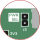

# Power 

{: style="width: 30rem;"}

{: style="width: 30rem;"}

{: style="width: 12rem;"}

{: style="width: 12rem;"}

{: style="width: 30rem;"}

{: style="width: 30rem;"}

{: style="width: 30rem;"}

<!--

%===============================================================
% Power 
%===============================================================
\newpage
\section{Power}
\label{sec:power}

%===============================================================
% Power : Overview
%===============================================================
\subsection{Overview}
\label{sec:power:overview}

%The Jay40 is designed for low power applications. When idle, it consumes less than 1 mA of power. In scenarios where the FPGA resources are highly utilized and switching frequently, the power consumption still remains under 2 mA.

%To provide maximum flexibility, the Jay40 can be powered from either a 3.3 V or 5 V supply.
%
%To accommodate a variety of use cases, the Jay40 can be powered from either a 3.3 V or 5 V supply. The majority of the board's circuitry operates at 3.3 V logic

The Jay40 primarily operates at a 3.3 V logic level. This includes the FPGA's I/O, flash chip, and oscillator. However, to accommodate a variety of use cases, the board can be powered from either 3.3 V or 5 V supply. When powered from a 5 V supply, an onboard LDO steps the input voltage down to 3.3 V. A second LDO steps the 3.3 V supply down to 1.2 V for the FPGA's core logic.

The Jay40 can either be powered through the \texttt{3V3} or \texttt{5V} power pins, or through the USB-C connector. Each of these options are described in more detail in the following subsections.

%The following sections describe the boards power distribution in more detail.  

%The majority of the board's circuitry operates at 3.3 V. However, to accommodate a variety of use cases, the board can be powered from either a 3.3 V or 5 V supply. In the 5 V case, an onboard LDO steps the input voltage down to 3.3 V. A second LDO further steps the 3.3 V down to the 1.2 V requred by the FPGA's core logic.

%Regardless of the power supply used, the board's I/O always operates at a 3.3 V logic level (excluding the 5V power pin).

%===============================================================
% Power : Power Select Jumper (PWR SEL)
%===============================================================
\subsection{Power Select Jumper (PWR SEL)}
\label{sec:power:power_select_jumper}

A simplified power tree diagram is shown in \autoref{fig:jay40_power_tree}. As noted above, power can be supplied to the board through the \texttt{3V3} power pins, \texttt{5V} power pin, or the USB-C connector.

\begin{figure}[H]
    \centering
    \vspace{0.6cm}
    \includegraphics[width=11cm]{../../diag/export/jay40_power_tree.pdf}
    \vspace{0.6cm}
    \caption{Power Tree}
    \label{fig:jay40_power_tree}
\end{figure}

The \texttt{PWR SEL} jumper connects the power output of the 3.3 V LDO to the rest of the 3.3 V rail. The jumper's setting (connected or disconnected) depends on the power supply used.

%Whether or not the jumper should be connected depends on the power supply used.  

When the board is powered from a 5 V source (either the \texttt{5V} power pin or the USB-C connector), the \texttt{PWR SEL} jumper should be connected as shown in \autoref{fig:jay40_pwr_sel_cutout_connected}. 

When the board is powered from the 3.3 V source, the \texttt{PWR SEL} jumper should be disconnected. This is shown in \autoref{fig:jay40_pwr_sel_cutout_disconnected}. Removing the \texttt{PWR SEL} jumper prevents the power output of the LDO from being shorted to the power source connecting to the \texttt{3V3} power pins.

%a short between the power output of the LDO and the power source coming through the 3V3 power pins. 

\begin{figure}[H]
    \centering
    \begin{minipage}{0.68\textwidth}
        \centering
        \includegraphics[width=10cm]{../../diag/export/jay40_pwr_sel_highlight.pdf}
        \caption{\texttt{PWR SEL} Location}
        \label{fig:jay40_pwr_sel_highlight}
    \end{minipage}
    \hfill
    \begin{minipage}{0.3\textwidth}
        \centering
        \includegraphics[width=4cm]{../../diag/export/jay40_pwr_sel_cutout_disconnected.pdf}
        \caption{3V3 Power Setting}
        \label{fig:jay40_pwr_sel_cutout_disconnected}

        \vspace{0.5cm}

        \includegraphics[width=4cm]{../../diag/export/jay40_pwr_sel_cutout_connected.pdf}
        \caption{5V Power Setting}
        \label{fig:jay40_pwr_sel_cutout_connected}
    \end{minipage}
\end{figure}

%j\begin{figure}[H]
%j    \centering
%j    \begin{minipage}{\textwidth}
%j        \centering
%j        \includegraphics[width=10cm]{../../diag/export/jay40_pwr_sel_highlight.pdf}
%j        \caption{Large figure}
%j        \label{fig:large}
%j    \end{minipage}
%j    \vspace{2cm}
%j    \begin{minipage}{0.3\textwidth}
%j        \centering
%j        %\includegraphics[width=10cm]{../../diag/export/jay40_pwr_sel_highlight.pdf}
%j        \includegraphics[width=4cm]{../../diag/export/jay40_pwr_sel_cutout_disconnected.pdf}
%j        \caption{Large figure}
%j        \label{fig:large}
%j    \end{minipage}
%j    \hspace{1.2cm}
%j    \begin{minipage}{0.3\textwidth}
%j        \centering
%j        %\includegraphics[width=10cm]{../../diag/export/jay40_pwr_sel_highlight.pdf}
%j        \includegraphics[width=4cm]{../../diag/export/jay40_pwr_sel_cutout_disconnected.pdf}
%j        \caption{Large figure}
%j        \label{fig:large}
%j    \end{minipage}
%j
%j    %\begin{minipage}{\textwidth}
%j    %    \centering
%j    %    \includegraphics[width=4cm]{../../diag/export/jay40_pwr_sel_cutout_disconnected.pdf}
%j    %    \caption{First small figure}
%j    %    \label{fig:small1}
%j
%j    %    \hspace{0.6}
%j
%j    %    \includegraphics[width=4cm]{../../diag/export/jay40_pwr_sel_cutout_connected.pdf}
%j    %    \caption{Second small figure}
%j    %    \label{fig:small2}
%j    %\end{minipage}
%j\end{figure}

%\begin{figure}[H]
%    \centering
%    \vspace{0.6cm}
%    \vspace{0.6cm}
%    \caption{PWR SEL Location}
%    \label{fig:pwr_sel_location}
%\end{figure}

%\begin{figure}[H]
%    \centering
%    \vspace{0.6cm}
%%\uselengthunit{mm}
%%Text width: \printlength{\textwidth}
%%Page width: \printlength{\paperwidth}
%    \begin{subfigure}{0.3\textwidth}
%        \centering
%        \includegraphics[width=5cm]{../../diag/export/jay40_pwr_sel_cutout_disconnected.pdf}
%        \vspace{0.6cm}
%        \caption{3V3 Power Setting}
%        \label{fig:3v3_power_setting}
%    \end{subfigure}
%    %\hfill
%    \hspace{0.6cm}
%    \begin{subfigure}{0.3\textwidth}
%        \centering
%        \includegraphics[width=5cm]{../../diag/export/jay40_pwr_sel_cutout_connected.pdf}
%        \vspace{0.6cm}
%        \caption{5V Power Setting}
%        \label{fig:5v_power_setting}
%    \end{subfigure}
%    \vspace{0.6cm}
%    \caption{LED EN Options}
%    \label{fig:led_locations}
%\end{figure}

%\begin{figure}[H]
%    \centering
%    \begin{minipage}{0.3\textwidth}
%        \centering
%        \vspace{0.6cm}
%        \includegraphics[width=5cm]{../../diag/export/jay40_pwr_sel_cutout_disconnected.pdf}
%        \vspace{0.6cm}
%        \caption{First figure}
%        \label{fig:first}
%    \end{minipage}
%    \hspace{0.6cm}
%    \begin{minipage}{0.3\textwidth}
%        \centering
%        \vspace{0.6cm}
%        \includegraphics[width=5cm]{../../diag/export/jay40_pwr_sel_cutout_connected.pdf}
%        \vspace{0.6cm}
%        \caption{Second figure}
%        \label{fig:second}
%    \end{minipage}
%\end{figure}

%\begin{figure}[H]
%    \centering
%    \begin{subfigure}{0.3\textwidth}
%        \centering
%%%skent%%        \includegraphics[width=\textwidth]{power_delivery_psel_location.pdf}
%        \caption{PWR SEL Jumper Location}
%        \label{fig:psel_jumper_location}
%    \end{subfigure}
%    \hfill
%    \begin{subfigure}{0.3\textwidth}
%        \centering
%%%skent%%        \includegraphics[width=\textwidth]{power_delivery_3v3_psel_setting.pdf}
%        \caption{3V3 Power Setting}
%        \label{fig:3v3_power_setting}
%    \end{subfigure}
%    \hfill
%    \begin{subfigure}{0.3\textwidth}
%        \centering
%%%skent%%        \includegraphics[width=\textwidth]{power_delivery_5v_psel_setting.pdf}
%        \caption{5V Power Setting}
%        \label{fig:5v_power_setting}
%    \end{subfigure}
%    \caption{Power Select (PWR SEL) Settings}
%    \label{fig:power_select_settings}
%\end{figure}

%===============================================================
% Power : 3V3 Pin Power
%===============================================================
\subsection{3V3 Pin Power}
\label{sec:power:3v3_pin_power}

The Jay40 can be powered directly through the 3V3 power pins. This allows the board to be easily integrated into larger systems that already have a regulated 3.3 V supply. It also simplifies the configuration setup by allowing the board and the host programmer to operate off of the same supply.

\autoref{fig:jay40_power_tree_3v3} depicts the power tree when powering the board through the 3V3 pins. 

\begin{figure}[H]
    \centering
%%skent%%    \includegraphics[width=13cm]{power_delivery_3v3.pdf}
    \vspace{0.6cm}
    \includegraphics[width=11cm]{../../diag/export/jay40_power_tree_3v3.pdf}
    \vspace{0.6cm}
    \caption{3V3 Pin Power Tree}
    \label{fig:jay40_power_tree_3v3}
\end{figure}

When powering the device through the \texttt{3V3} power pins, the \texttt{PWR SEL} jumper must be disconnected as shown in \autoref{fig:jay40_pwr_sel_cutout_disconnected}.

%===============================================================
% Power : 5V Pin Power
%===============================================================
\subsection{5V Pin Power}
\label{sec:power:5v_pin_power}

The board can also be powered through the \texttt{5V} power pin. This can be a convenient option when only a 5 V supply is available. The 5 V input is stepped down to 3.3 V by an LDO for use by the rest of the board.

\autoref{fig:jay40_power_tree_5v} depicts the power tree when powering the board through the \texttt{5V} pin. 

\begin{figure}[H]
    \centering
%%skent%%    \includegraphics[width=13cm]{power_delivery_5v.pdf}
    \vspace{0.6cm}
    \includegraphics[width=11cm]{../../diag/export/jay40_power_tree_5v.pdf}
    \vspace{0.6cm}
    \caption{5V Pin Power Tree}
    \label{fig:jay40_power_tree_5v}
\end{figure}

When powering the device through the \texttt{5V} power pin, the \texttt{PWR SEL} jumper should be connected. This connects the power output of the LDO to the rest of the 3.3 V rail. In this configuration, the \texttt{3V3} power pins are driven by the LDO and can be used as power outputs.

%===============================================================
% Power : USB-C Power
%===============================================================
\subsection{USB-C Power}
\label{sec:power:usb_c_power}

%The USB-C connector can also be used to provide power to the board. 

In addition to the \texttt{3V3} and \texttt{5V} power pins, the board can also be powered through the USB-C connector. The USB-C connector provides the board with a 5 V supply.

\autoref{fig:jay40_power_tree_usb_c} depicts the power tree when powering the board through the USB-C connector. As in the \texttt{5V} pin case, the \texttt{PWR SEL} jumper should be connected.

\begin{figure}[H]
    \centering
    \vspace{0.6cm}
    \includegraphics[width=11cm]{../../diag/export/jay40_power_tree_usb_c.pdf}
    \vspace{0.6cm}
    \caption{USB-C Power Tree}
    \label{fig:jay40_power_tree_usb_c}
\end{figure}

%When powering the board through the USB-C connector, the PWR SEL jumper should be connected. This is the same setup used when powering the board through the 5V power pin. When power is supplied through the USB-C connector, both the 5V and 3V3 power pins can be used as power outputs.

When power is supplied through the USB-C connector, both the \texttt{5V} and \texttt{3V3} power pins can be used as power outputs. The USB-C connector is for power only. Data cannot be transferred to or from the device through the connector.

-->
